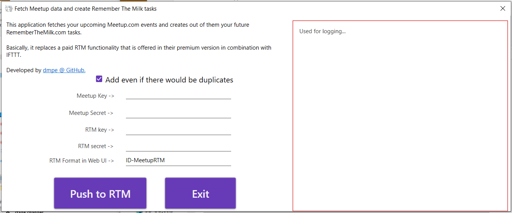
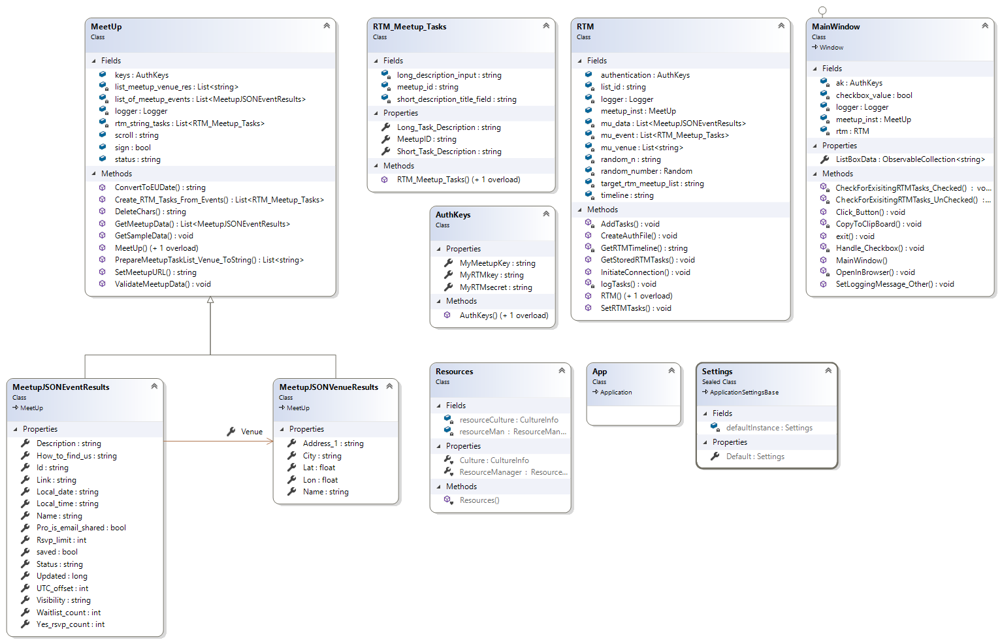

[](https://johnmalc.visualstudio.com/MeetupToRTM/_build/latest?definitionId=4&branchName=master)
[](https://sonarcloud.io/dashboard?id=dmpe_MeetupToRTM) 
[](https://sonarcloud.io/component_measures/metric/reliability_rating/list?id=dmpe_MeetupToRTM)
[](https://sonarcloud.io/component_measures/metric/security_rating/list?id=dmpe_MeetupToRTM)
[](https://sonarcloud.io/dashboard?id=dmpe_MeetupToRTM)
[](https://sonarcloud.io/dashboard?id=dmpe_MeetupToRTM)

[](https://snyk.io/test/github/dmpe/MeetupToRTM?targetFile=MeetupToRTM/Core.csproj)
[](https://snyk.io/test/github/dmpe/MeetupToRTM?targetFile=Tests/Tests.csproj)

  
# MeetupToRTM: C# .NetFramework 4.7 Desktop Application

Use this app to export your upcoming Meetup.com events into Remember The Milk tasks.
And therefore, avoid paying for such functionality through [IFTTT](https://www.rememberthemilk.com/services/ifttt/) :yay:

## Features/TODO:

 - Fetches your [meetup events](https://www.meetup.com/meetup_api/docs/self/events/) and convert them to tasks. 
   The format used, by default and which can be also adjusted, is <ID-MeetupRTM: _meetupEventID_ _MeetupName_>. 
 
 - 100% Privacy-focused - my app has no tracking whatsoever. It only writes a [log file](https://github.com/nlog/nlog) to the folder from which program is executed.

 - [ ] Unfortunately, it will not recognize already added tasks and hence will add them again. 
 You will need to de-clutter your list for avoiding duplicates. See [Issue](https://github.com/dmpe/MeetupToRTM/issues/2)
 
 - full CI/CD pipeline with Azure DevOps, resulting into [GitHub releases](https://github.com/dmpe/MeetupToRTM/releases)

### Requirenments to making it work:

You will need to have 2 API keys:

 - OAuth2 (since 2019) app from Meetup <https://secure.meetup.com/meetup_api/key/>
 - API Keys from RTM <https://www.rememberthemilk.com/services/api/>




## Building/Testing MeetupToRTM

I use Azure Pipelines for CI/CD. See here <https://johnmalc.visualstudio.com/MeetupToRTM/_build/>

How to update submodule to point to the latest changes?

```
cd MeetupToRTM
git submodule update --remote 
```

## How to start

Download from release page a `zip` archive and unpack it somewhere. 
Double click on exe file -> app should start automatically.

**Class Diagram anybody ? Sure here we go:**




# Achievements

In order to make this application work, I had to fork and submit patches to the <https://github.com/dmpe/RememberTheMilkApi>, see `merged_branch_with_all_changes` branch. 
Indeed, this programm depends on the upstream RTM library.
