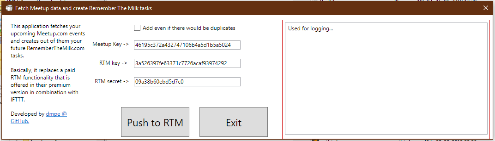

 
 
 
 
 
# MeetupToRTM: C# .NetFramework 4.7 Desktop Application

## Objective:
 - Export your upcoming Meetup.com events into Remember The Milk tasks.
   - Thus replacing a paid functionality available through <https://www.rememberthemilk.com/services/ifttt/>

### Features/TODO:
 - Fetches your [meetup events](https://www.meetup.com/meetup_api/docs/self/events/) and converts them to tasks via format <ID-MeetupRTM: _meetupEventID_ _MeetupName_>. 
 
 - [ ] In case, the of frequent use, the app can recognize already added tasks (through above format) and will skip adding them again. Therefore de-cluttering your list and avoding adding duplicates. :yum:

#### Requirenments to making it work:

You will need to have 2 API keys:

 - API Key from Meetup <https://secure.meetup.com/meetup_api/key/>
 - API Keys from RTM <https://www.rememberthemilk.com/services/api/>

# Building/Testing MeetupToRTM

An attempt was made to use Azure Pipelines for CI/CD. 
See here <https://johnmalc.visualstudio.com/GitHubRepos/_build/>

# Achievements

In order to make this application work, I had to fork and submit patches to the <https://github.com/dmpe/RememberTheMilkApi>, including `merged_branch_with_all_changes` branch.

