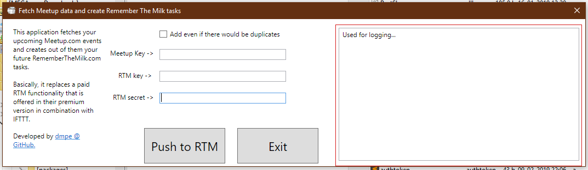

# MeetupToRTM

## Objective:
 - Export your upcoming Meetup.com events into Remember The Milk tasks.
 - Replace a paid functionality available through <https://www.rememberthemilk.com/services/ifttt/>

### Features/TODO:
 - Fetches your meetup events and converts them to tasks via format <ID-MeetupRTM: _meetupEventID_ _MeetupName_>. 
 - In case, the of frequent use, the app can recognize already added tasks (through above format) and will skip adding them again. Thus de-cluttering your list and avoding adding duplicates.

